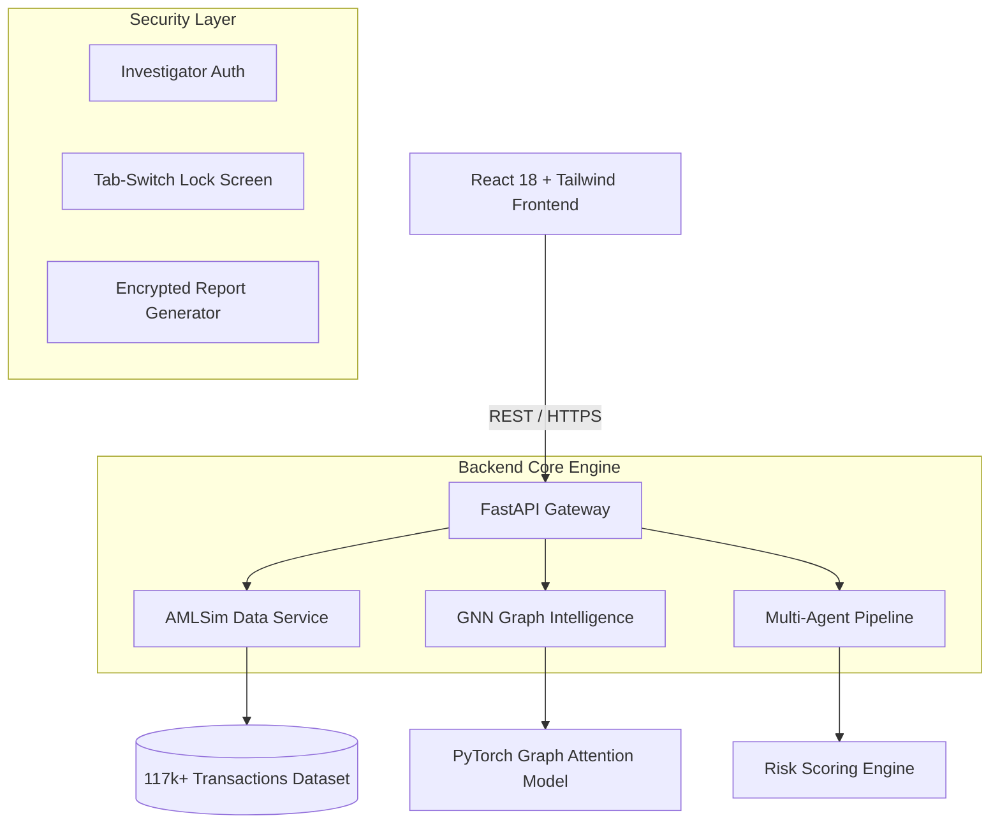

# RING//BREAK

**Financial Fraud Ring Detection & Multi-Agent Forensic Platform**

An autonomous, GNN-powered platform for detecting fraud rings, analyzing transaction graphs, and running multi-agent investigations across large-scale financial networks.


---

## Table of Contents

- [Overview](#overview)
- [Key Features](#key-features)
- [Tech Stack](#tech-stack)
- [System Architecture](#system-architecture)
- [Live Demo](#live-demo)
- [API Reference](#api-reference)
- [Getting Started](#getting-started)
- [Deployment](#deployment)
- [License](#license)

---

## Overview

RING//BREAK is a financial crime investigation engine built to detect, analyze, and disrupt coordinated fraud rings hidden within high-velocity transaction streams.

The platform is built on the synthetic **AMLSim** dataset and pairs **Graph Attention Networks (GAT)** with an **autonomous multi-agent intelligence pipeline**. Together they surface circular laundering loops, fan-in layering patterns, and repeat-offender networks.

| Dataset Metric | Value |
| :--- | :--- |
| Transaction edges | 117,000+ |
| Account nodes | 1,000 |
| Alert clusters | 40 |

---

## Key Features

### Graph Attention Network Engine

- **Structural clique detection** – identifies tightly bound subgraphs and cyclic transaction loops using a 2-layer GAT.
- **Edge attention weights** – learned weights highlight suspicious transaction corridors.
- **Fast graph indexing** – pre-indexed adjacency tables provide O(1) node-neighbor lookups across 117k+ transactions.

### Autonomous Multi-Agent Forensic Pipeline

When a transaction is flagged, four specialized agents collaborate sequentially:

| Agent | Responsibility |
| :--- | :--- |
| **Detection Agent** | Analyzes velocity, amount anomalies, and alert pattern history. |
| **Topology Agent** | Extracts graph metrics: clustering coefficient, cycle depth, and fan-in/fan-out degree. |
| **Risk Assessment Agent** | Computes a dynamic risk score (0–100) from graph topology and historical recurrence. |
| **Countermeasure Simulation Agent** | Recommends account freezes, transaction holds, or enhanced due diligence (EDD). |

### Security & Investigator Controls

- **Investigator authentication** – access requires authenticated investigator credentials.
- **Tab-switch lock screen** – the application locks immediately when the investigator switches browser tabs (via the `visibilitychange` event).
- **Encrypted forensic reports** – investigation summaries are exported as AES password-protected PDFs, using the investigation **Trace ID** as the password to support compliance workflows.

---

## Tech Stack

| Layer | Technology |
| :--- | :--- |
| Backend | Python 3.11+, FastAPI, Uvicorn |
| Machine Learning | PyTorch, PyTorch Geometric (GAT) |
| Frontend | React 18, TypeScript, Tailwind CSS, Vite |
| Data | AMLSim synthetic transaction dataset |
| Hosting | Railway / Render (backend), Vercel / Netlify (frontend) |

---

## System Architecture



---

## Live Demo

**Deployed application:** https://ringbreak-fraud-detection-pu6ys9sic-cse271025-sudos-projects.vercel.app/

---

## API Reference

### Health

```http
GET /health
```

**Response `200 OK`**

```json
{
  "status": "ok"
}
```

### Dataset Status

```http
GET /amlsim/status
```

**Response `200 OK`**

```json
{
  "sourceDataset": "AMLSim",
  "mode": "LIVE",
  "datasetAvailable": true,
  "transactionCount": 117533,
  "accountCount": 1000,
  "alertGroupCount": 40,
  "backendReachable": true
}
```

### Fraud Ring Check

```http
GET /amlsim/ring-check/{transaction_id}
```

| Parameter | Type | Description |
| :--- | :--- | :--- |
| `transaction_id` | string | ID of the transaction to evaluate. |

**Response `200 OK`**

```json
{
  "transactionId": "10253",
  "detected": true,
  "reason": "Alert group #12 cycle membership found.",
  "ring": {
    "ringId": "AMLSIM-ALERT-12",
    "confidence": 92,
    "members": ["793", "752", "783"],
    "memberCount": 3,
    "transactionVolume": 5,
    "amountInvolved": 10250.0,
    "currency": "USD"
  }
}
```

---

## Getting Started

### Prerequisites

- Python 3.11+
- Node.js 18+
- npm 9+

### 1. Backend

```bash
git clone https://github.com/your-org/ring-fraud.git
cd ring-fraud/backend

# Create and activate a virtual environment
python -m venv .venv
source .venv/bin/activate      # Windows: .venv\Scripts\activate

# Install dependencies
pip install -r requirements.txt

# Start the FastAPI server
uvicorn app.main:app --host 0.0.0.0 --port 8000
```

### 2. Frontend

```bash
cd ../frontend

# Install dependencies
npm install

# Start the Vite development server
npm run dev
```

Open <http://localhost:5173> in your browser.

---

## Deployment

### Backend (Railway / Render)

| Setting | Value |
| :--- | :--- |
| Root directory | `backend/` |
| Build | Dependencies installed from `requirements.txt` |
| Start command | `uvicorn app.main:app --host 0.0.0.0 --port $PORT` |
| Port | Dynamic `$PORT` (or `8080`) |

### Frontend (Vercel / Netlify)

| Setting | Value |
| :--- | :--- |
| Root directory | `frontend/` |
| Framework preset | Vite |
| Build command | `npm run build` |
| Output directory | `dist` |

Set the following environment variable:

```env
VITE_API_BASE_URL=https://ringbreak-fraud-detection-production-e148.up.railway.app
```

---

## License

This project is licensed under the MIT License. See the [`LICENSE`](LICENSE) file for details.
