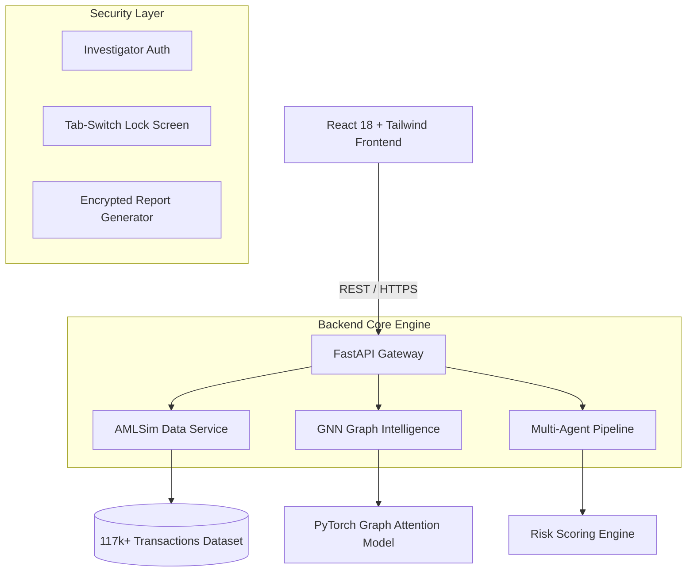

# Chella Krishnan D

### Backend & Full-Stack Engineer

**Distributed Systems · Real-Time Applications · Applied ML & Cloud**

*Building scalable, production-oriented systems that think, sync, and scale.*

[About](#about) · [Projects](#featured-projects) · [Skills](#technical-skills) · [Education](#education) · [Certifications](#certifications) · [Contact](#contact)

---

## About

I am a Computer Science engineering student in Trichy, India, focused on backend and full-stack development. I build real-time collaboration platforms, cloud infrastructure intelligence, enterprise workflow systems, and graph-based fraud detection.

- **Systems over screens.** Architecture, data flow, and reliability come first; the interface follows.
- **Decisions backed by data.** I combine machine learning with rule-based logic so outputs stay explainable and auditable.
- **Production mindset.** Every project is deployed, documented, and structured for real use.

---

## At a Glance

| Project | Domain | Core Idea | Live |
| :--- | :--- | :--- | :--- |
| **RING//BREAK** | Fraud detection · Graph ML | GAT + four-agent forensic pipeline | [Open](https://ringbreak-fraud-detection.vercel.app/) |
| **CodeSync** | Real-time systems | Collaborative coding with AI code intelligence | [Open](https://code-sync-sooty.vercel.app/) |
| **CloudPulse** | Cloud intelligence | ML-driven EC2 resource optimization | [Open](https://cloud-resource.vercel.app/) |
| **TaskForge** | Enterprise workflow | RBAC project and task orchestration | [Open](https://project-management-system-mu-seven.vercel.app/login) |

---

## Featured Projects

### 🔍 RING//BREAK

**Financial Fraud Ring Detection & Multi-Agent Forensic Platform**

An autonomous platform for detecting fraud rings, analyzing transaction graphs, and running multi-agent investigations across large-scale financial networks. It pairs a Graph Attention Network with a sequential agent pipeline to surface circular laundering loops, fan-in layering patterns, and repeat-offender networks.

**Live:** <https://ringbreak-fraud-detection.vercel.app/>

| Dataset Metric | Value |
| :--- | :--- |
| Transaction edges | 117,000+ |
| Account nodes | 1,000 |
| Alert clusters | 40 |

**Key capabilities**

- **Graph intelligence:** A 2-layer GAT detects tightly bound subgraphs and cyclic transaction loops, with learned edge attention weights highlighting suspicious corridors.
- **Fast graph access:** Pre-indexed adjacency tables give O(1) neighbor lookups across 117k+ transactions.
- **Multi-agent investigation:** Four specialized agents collaborate on every flagged transaction.
- **Investigator security:** Authenticated access, an instant tab-switch lock screen (`visibilitychange`), and AES password-protected PDF reports keyed to the investigation Trace ID.

**Agent pipeline**

| Agent | Responsibility |
| :--- | :--- |
| Detection Agent | Analyzes velocity, amount anomalies, and alert pattern history |
| Topology Agent | Extracts clustering coefficient, cycle depth, and fan-in/fan-out degree |
| Risk Assessment Agent | Computes a dynamic 0–100 risk score from topology and historical recurrence |
| Countermeasure Simulation Agent | Recommends account freezes, transaction holds, or enhanced due diligence |

**Architecture**

**Stack:** `Python` `FastAPI` `PyTorch` `PyTorch Geometric` `React 18` `TypeScript` `Tailwind CSS` `Vite`
**Deployment:** Railway (backend) · Vercel (frontend)

---

### 💻 CodeSync

**Real-Time Collaborative Coding Platform**

A collaborative coding platform supporting synchronized multi-user code editing and live programming sessions, with AI-powered code intelligence built in.

**Live:** <https://code-sync-sooty.vercel.app/>

**Key capabilities**

- **Live collaboration:** Synchronized multi-user editing with concurrent conflict resolution.
- **Low-latency communication:** Socket.IO WebSocket architecture delivering real-time, bi-directional session synchronization.
- **AI code intelligence:** Gemini API integration for automated code analysis, optimization suggestions, and interview-mode assistance workflows.
- **Scalable session state:** Event-driven session management with distributed persistence on Firebase Firestore, tracking collaboration state across concurrent sessions.

**Stack:** `React.js` `Socket.IO` `Node.js` `Firebase` `Gemini API`

---

### ☁️ CloudPulse

**Cloud Infrastructure Monitoring & Analytics Platform**

A monitoring and analytics platform for performance tracking, intelligent auto-scaling simulation, and resource optimization across AWS environments.

**Live:** <https://cloud-resource.vercel.app/>

**Key capabilities**

- **ML-driven prediction:** Random Forest models predict infrastructure utilization states to support data-driven EC2 resource allocation and cost optimization.
- **Interactive dashboards:** Real-time views of CPU, memory, and workload analytics with simulation-driven scaling recommendations.
- **Decision-intelligence pipelines:** Workload-based EC2 instance recommendation workflows.
- **Modular backend:** FastAPI microservices for provisioning-efficiency recommendations.

**Stack:** `React.js` `FastAPI` `Scikit-learn` `Pandas` `AWS`

---

### 📋 TaskForge

**Enterprise Workflow & Project Management Platform**

A full-stack workflow management platform for structured project tracking, task orchestration, and real-time team collaboration across multi-role organizations.

**Live:** <https://project-management-system-mu-seven.vercel.app/login>

**Key capabilities**

- **Role-based access control:** Admin, Manager, and User roles with secure JWT-based authentication and dynamic dashboard routing.
- **Lifecycle management:** End-to-end project and task tracking with priority classification, deadline tracking, and persistent activity logging.
- **Real-time collaboration:** Firestore NoSQL data models and synchronization pipelines enabling cross-user updates with sub-second latency.

**Stack:** `React.js` `Firebase` `Firestore` `Tailwind CSS`

---

## Technical Skills

| Category | Technologies |
| :--- | :--- |
| **Languages** | Python, Java, C++, JavaScript, TypeScript |
| **Web & Backend** | React.js, Next.js, Node.js, Express.js, REST APIs, WebSockets, Socket.IO |
| **Databases** | MongoDB, MySQL, PostgreSQL, Firebase Firestore |
| **Cloud & DevOps** | AWS (EC2, S3, Lambda), Docker, Git, Linux |
| **AI/ML & Data** | PyTorch, Scikit-learn, OpenCV, YOLO, Pandas, NumPy |
| **Tools & Technologies** | JWT Authentication, Postman, FastAPI, Gemini API |

---

## Education

**Saranathan College of Engineering**, Trichy, India
Bachelor of Engineering · CGPA 8.28 / 10.0 · Aug 2024 – May 2028

---

## Certifications

| Certification | Issuer |
| :--- | :--- |
| AWS Cloud Practitioner Essentials | Amazon Web Services |
| Introduction to Machine Learning | Google Cloud Skills Boost |
| Intro to Machine Learning & Python | Kaggle |
| Back End Development and APIs Certification | freeCodeCamp |
| Introduction to Cybersecurity | Cisco Networking Academy |

---

## Contact

- **Email:** [iamkrishnawriter@gmail.com](mailto:iamkrishnawriter@gmail.com)
- **LinkedIn:** [Chella Krishnan D](https://linkedin.com/in/chella-krishnan-d-a91172383)
- **GitHub:** [iamkr07](https://github.com/iamkr07)
- **Location:** Trichy, India

---

*I don't just build apps. I build systems that think, sync, and scale.*

